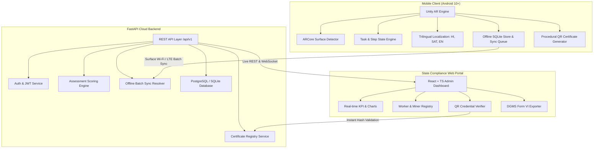

# JH-Safety AR — System Architecture Documentation

**Problem Statement ID:** 26041  
**Platform:** Mobile AR (Unity 2022.3 LTS) + FastAPI Backend (Python 3.12) + Admin Dashboard (React + TypeScript + Tailwind CSS v4)

---

## 1. High-Level Architecture

---

## 2. Core Subsystems

### A. AR Training & Simulation Subsystem
- Uses **AR Foundation 5.1** and **ARCore** for plane surface detection on horizontal mine floors and conveyor platforms.
- Includes raycast touch interactions with interactive 3D hazard objects (Hotspots, DCP Extinguishers, SCSR Packs, Multi-Gas Probes).
- Features **3D Touch Simulation Fallback Mode** for phones without hardware AR sensors.

### B. Trilingual Localization Subsystem
- Runtime language switching between **Hindi (हिंदी)**, **Santali (ᱥᱟᱱᱛᱟᱲᱤ - Ol Chiki)**, and **English**.
- Decoupled JSON language catalogs loaded from `Resources/Localization/`.
- TextMeshPro unicode rendering for Ol Chiki indigenous tribal script.

### C. Assessment & Examination Engine
- Weighted composite scoring: **60% Practical AR Performance + 40% Theoretical MCQ Knowledge**.
- Strict **70% pass threshold** mandated by DGMS safety guidelines.

### D. Cryptographic Certificate & QR Ledger
- Issues standardized certificate IDs: `JH-SAFE-YYYY-COMPANY-XXXXX`.
- Embeds verifiable URL and SHA-256 integrity hash into procedural QR code.

### E. Offline-First Sync Architecture
- Workers can complete simulations underground without connectivity.
- Training attempts are buffered in SQLite and automatically uploaded in batches once surface connectivity is detected.
